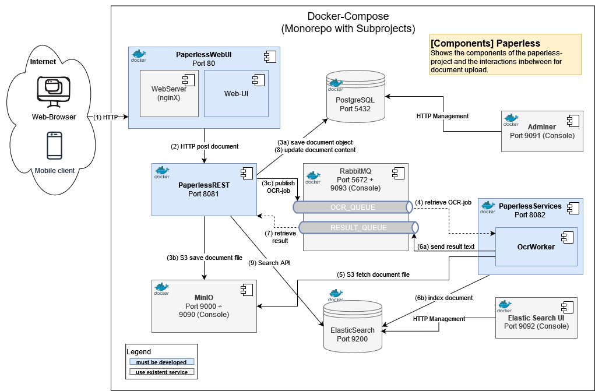

# Softwarekomponentensysteme Labor (SWKOM)

### Project Paperless: Document Management System (DMS)

The goal of this project is a Document Management System (DMS) for archiving documents in a FileStore, with automatic OCR (queue for OC-recognition), tagging and full text search (ElasticSearch). Users can upload documents, (fuzzy) search documents and manage the documents metadata. DMS performs OCR automatically and creates an index in ElasticSearch.

### Sprints

- Sprint 1: Project-Setup, REST API
- Sprint 2: WebUI
- Sprint 3: Data Access Layer (DAL), PostgreSQL
- Sprint 4: RabbitMQ Integartion
- Sprint 5: OCR Service
- Sprint 6: ElasticSearch Integration
- Sprint 7: Finalization

### Project Architecture

Techstack: C#, ASP .Net 8.0, Docker, RabbitMQ, PostgreSQL, ElasticSearch, Git

